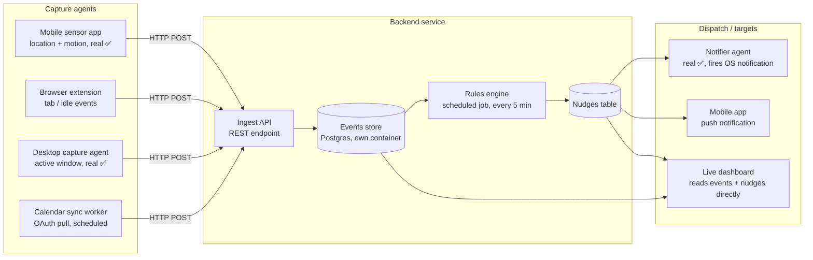

# Deskemon — Design

## Concept

Converge physical-world context (location, motion) with digital-world context
(browser activity, active app, calendar) to detect wellbeing-relevant patterns
and nudge the user — sedentary time, cognitive load/stress proxy, and
hydration/food/medicine reminders.

## Two-piece framework: Input / Output

### INPUT

Raw signals from physical + digital world, captured and converged into a
single events store.

| Source | Signal | Capture method |
|---|---|---|
| Phone (passive) | GPS/location, accelerometer/motion | Background mobile app (or existing sensor-logging app, e.g. Sensor Logger) posting samples every N seconds to backend via HTTP |
| Browser | Active tab URL/title, time-on-tab, idle state | Browser extension (`chrome.tabs` + `idle` API) posting events on tab-change/focus/idle |
| Desktop | Foreground app + window title | Small local agent (e.g. Node `active-win`, or macOS `NSWorkspace`) polling every few seconds |
| Calendar | Meeting start/end, title, back-to-back gaps | Google/Outlook Calendar API (OAuth), polled or webhook-subscribed |

All sources write to a single **events table**: `(timestamp, source, type, payload)`.

### OUTPUT

Actionable nudges/insights, generated by a rules/scoring engine and pushed to
notification targets.

**Generation** — rules engine runs periodically (e.g. every 5 min) over the
recent events window:

- **Sedentary score** — no movement/location change for X minutes (location + motion)
- **Cognitive-load / stress proxy** — tab-switch rate + meeting density + typing bursts (not real physiological stress — a synthetic proxy, framed as such)
- **Reminder triggers** — hydration/food/medicine on a schedule, suppressed during meetings using calendar data

**Push targets**:

- Desktop OS notification (via the local agent)
- Phone push notification (if mobile app exists — local notification API)
- Live dashboard (web page showing current state + nudge log) — most demo-friendly, no notification permissions needed

## Pipeline

```
sensors / extension / agent / calendar
        -> events store
        -> rules engine (scheduled)
        -> notification dispatcher (OS notification | push | dashboard)
```

## Architecture diagram



## Components vs. Agents

Kept strictly separate: a **component** is a passive piece of infrastructure
(a data store, a table, an API endpoint) — it doesn't run on its own or make
decisions. An **agent** is an actual running process/binary that does
something on a schedule or in response to events.

### Components (infrastructure — no independent runtime behavior)

| # | Component | Type | Notes |
|---|---|---|---|
| C1 | Events table | Postgres table, own container | `(timestamp, source, type, payload)` — all raw input lands here |
| C2 | Nudges table | Postgres table, own container | `(timestamp, type, message, dismissed)` — generated alerts land here |
| C3 | Ingest API | FastAPI HTTP endpoint | `POST /events` — the only write path into C1, used by every agent |
| C4 | Dashboard | React + Vite, served by nginx | Reads C1 + C2 via the API (read-only, no writes) |

### Agents (running processes/binaries)

One agent, one responsibility — capture and dispatch are always separate
processes, never combined.

| # | Agent | Type / where it runs | What it does | Status |
|---|---|---|---|---|
| A1 | Desktop capture agent | Native script on the work computer (`desktop-agent/`), polling loop | Reads foreground app/window title via `osascript` → posts to C3 | ✅ built |
| A2 | Browser extension | Runs inside the browser | Reads active tab URL/title + idle state → posts to C3 on tab-change/focus/idle | simulated only |
| A3 | Calendar sync worker | Backend-side scheduled process | Pulls Google/Outlook Calendar via OAuth on a schedule → posts meeting events to C3 | simulated only |
| A4 | Rules engine | Backend-side scheduled process (cron, every 5 min) | Reads recent rows from C1 → computes sedentary score, cognitive-load proxy, reminder triggers → writes rows to C2 | ✅ built |
| A5 | Sensor Logger app (third-party) | Existing mobile app, not built by us | Streams real GPS/accelerometer data via HTTP webhook → posts to C3 | ✅ built (`POST /webhooks/sensor-logger`) |
| A6 | Notifier agent | Native script on the work computer (`notifier-agent/`), polling loop | Reads C2 via `GET /nudges` → fires a native OS notification for each new, undismissed nudge | ✅ built |
| — | Simulator | Dockerized service (`simulator/`) | Fake capture agent standing in for A2/A3/A5 until they're built for real, plus triggers A4 on a fast cadence | ✅ built |

A1–A6 are ours to build; A5's real counterpart is a third-party app we'd
configure/point at C3 rather than write code for.

### Build order (priority for a hackathon)

1. ✅ C1 + C2 + C3 (backend foundation — nothing else works without these)
2. ✅ A4 Rules engine (demoable immediately using seeded/fake rows in C1)
3. ✅ C4 Dashboard (makes A4's output visible)
4. ✅ A1 Desktop capture agent + A6 Notifier agent (real digital signal +
   real notification dispatch, built as two separate processes)
5. A2 Browser extension (real digital signal)
6. A3 Calendar sync worker (enriches A4 with meeting-aware logic)
7. ✅ A5 Sensor Logger app config (real physical signal — last, since it's third-party config, not new code)

## Decisions

- **Backend stack**: Python + FastAPI for the ingest API + rules engine, Postgres for the events/nudges store — running in its own container, not embedded, so it can be inspected independently (e.g. via DBeaver).
- **Mobile capture**: Sensor Logger app (existing third-party app) streams real GPS/accelerometer data via HTTP webhook. Backend maps its payload into our `events` schema (`source="phone"`).
- **Stress proxy labeling**: shipped as an explicitly labeled "experimental proxy" in the dashboard/nudges (e.g. "Cognitive load (experimental)"), never presented as real physiological stress detection.
- **Agent granularity**: every agent does exactly one thing. Desktop capture (A1) and notification dispatch (A6) were originally planned as one dual-role agent, but were split into two independent processes — no agent both captures and dispatches.
